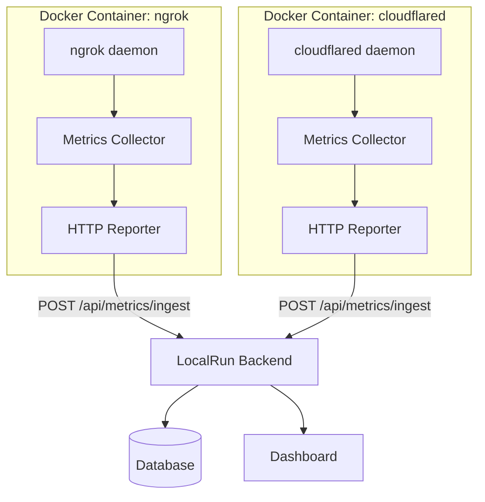

# LocalRun Agent

[](https://github.com/localrunapp/tunnel-agent/actions/workflows/ci.yml)
[](https://github.com/localrunapp/tunnel-agent/actions/workflows/docker-publish.yml)

Universal metrics collection agent for tunnel providers. Runs as Docker containers alongside tunnel services (ngrok, cloudflared) and reports metrics to LocalRun backend via HTTP.

## Architecture



Each container includes:
- Tunnel provider daemon (ngrok, cloudflared)
- Metrics collector (monitors tunnel status, requests, bandwidth)
- HTTP reporter (sends metrics every 10 seconds)

## Installation

### Docker Images

```bash
# Pull from GitHub Container Registry
docker pull ghcr.io/localrunapp/ngrok:latest
docker pull ghcr.io/localrunapp/cloudflared:latest
```

### CLI (Development)

```bash
npm install -g localrun-agent
localrun-agent start ngrok --port 8000
```

## Usage

### ngrok

```bash
docker run -d \
  --name ngrok-tunnel \
  --network localrun_network \
  -e PROVIDER=ngrok \
  -e TUNNEL_PORT=8000 \
  -e TUNNEL_ID=my-app \
  -e BACKEND_URL=http://backend:8000 \
  -e NGROK_AUTHTOKEN=your_token \
  ghcr.io/localrunapp/ngrok:latest \
  http host.docker.internal:8000
```

### cloudflared

```bash
docker run -d \
  --name cloudflared-tunnel \
  --network localrun_network \
  -e PROVIDER=cloudflare \
  -e TUNNEL_PORT=3000 \
  -e TUNNEL_ID=my-app \
  -e BACKEND_URL=http://backend:8000 \
  ghcr.io/localrunapp/cloudflared:latest \
  tunnel --url http://host.docker.internal:3000
```

## Environment Variables

| Variable | Required | Description | Default |
|----------|----------|-------------|---------|
| `PROVIDER` | Yes | Provider name (`ngrok`, `cloudflare`) | - |
| `TUNNEL_PORT` | Yes | Local port to expose | - |
| `TUNNEL_ID` | No | Unique tunnel identifier | `{provider}-{port}` |
| `BACKEND_URL` | No | LocalRun backend URL | `http://backend:8000` |
| `METRICS_INTERVAL` | No | Collection interval (seconds) | `10` |
| `NGROK_AUTHTOKEN` | Yes* | ngrok authentication token | - |

*Required only for ngrok

## Metrics Format

Metrics are sent via HTTP POST to `{BACKEND_URL}/api/metrics/ingest`:

```json
{
  "provider": "ngrok",
  "tunnel_id": "my-app",
  "tunnel_port": 8000,
  "timestamp": 1733172000.123,
  "metrics": {
    "tunnel": {
      "public_url": "https://abc123.ngrok.io",
      "protocol": "https",
      "status": "running",
      "uptime_seconds": 3600
    },
    "requests": {
      "total": 1250,
      "rate_1m": 15.2,
      "rate_5m": 12.8,
      "errors": 5
    },
    "bandwidth": {
      "bytes_in": 5242880,
      "bytes_out": 10485760,
      "rate_in_bps": 8192,
      "rate_out_bps": 16384
    },
    "container": {
      "memory_usage_bytes": 52428800,
      "memory_percent": 9.77,
      "cpu_percent": 2.5,
      "network_rx_bytes": 1048576,
      "network_tx_bytes": 2097152
    }
  }
}
```

## Supported Providers

| Provider | Status | Image |
|----------|--------|-------|
| ngrok | Production | `ghcr.io/localrunapp/ngrok` |
| cloudflared | Production | `ghcr.io/localrunapp/cloudflared` |
| localhost.run | Planned | - |

## Development

### Build

```bash
npm install
npm run build
```

### Run Locally

```bash
npm run dev start ngrok --port 8000 --backend-url http://localhost:8000
```

### Release

```bash
# Create a new release (builds and publishes Docker images)
make release-patch  # 1.0.0 -> 1.0.1
make release-minor  # 1.0.0 -> 1.1.0
make release-major  # 1.0.0 -> 2.0.0
```

## Backend Integration

Your LocalRun backend must implement the metrics ingestion endpoint:

```python
@app.post("/api/metrics/ingest")
async def ingest_metrics(metrics: dict):
    # Store metrics in database
    # Update tunnel status
    # Trigger alerts if needed
    return {"status": "ok"}
```

## License

MIT
